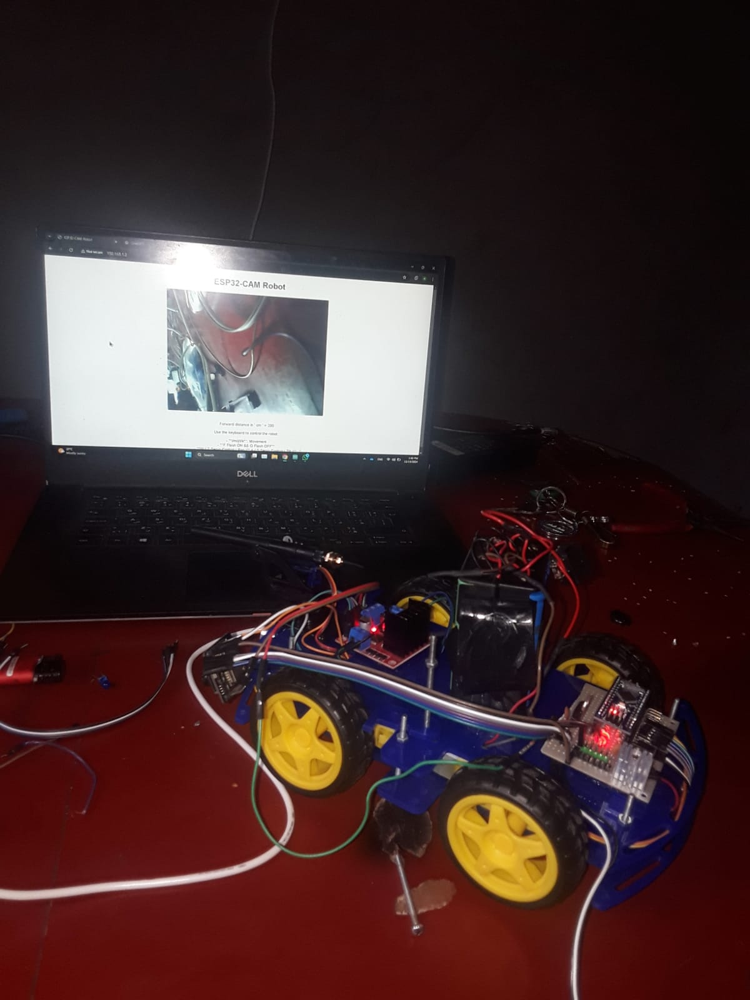
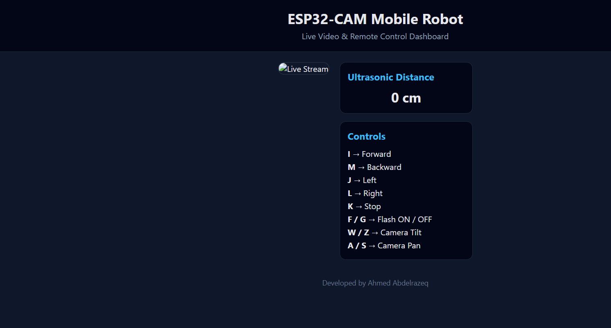
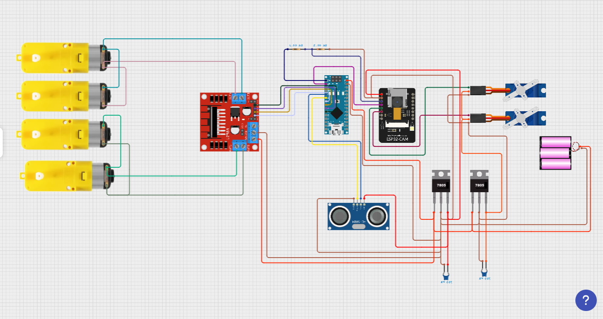

# ESP32-CAM Robotic Car Controlled via Web Interface

A prototype **ESP32-CAM robotic car** controlled using a web-based interface.  
The system allows real-time manual control, camera pan/tilt, flash toggle, and distance measurement, making it suitable for robotics learning, experimentation, and future expansion.

---

## 📌 Project Overview

This project presents the design and implementation of a **camera-equipped robotic car** with web-based control.  
The control system is divided between:
- **ESP32-CAM** for camera streaming, servo control, and web server
- **Arduino MCU** for motor control (via Serial2 communication)

Although developed as an **academic project**, the system demonstrates embedded programming, web development, and robotics integration, and is scalable for future enhancements.

---

## 🤖 Mechanical & Actuation Details

- **Motors:** 2 DC motors (driven by Arduino motor driver)  
- **Servos:** 2 (Pan and Tilt for camera)  
- **Camera:** ESP32-CAM module  
- **Flash:** On-board LED for illumination  
- **Distance Measurement:** Using serial feedback from Arduino  

---

## 🧠 Control System Architecture

- **ESP32-CAM**: Streams live video, handles web interface, servo control, distance display  
- **Arduino MCU**: Executes motor commands from ESP32-CAM  

The web interface allows the user to:
- Drive the robot in real-time
- Control camera orientation
- Toggle the flash
- Monitor front obstacle distance

---

## ⚙️ Features

- ✔ Real-time video streaming via browser  
- ✔ Keyboard-based driving (`i/m/j/l/k`)  
- ✔ Servo pan/tilt camera control (`W/Z` for tilt, `A/S` for pan)  
- ✔ Flash control (`F`/`G`)  
- ✔ Front distance measurement display  
- ✔ Modular and extendable system design  
- ✔ Demonstrates embedded programming + web integration  

---

## 🛠️ Technologies Used

- ESP32-CAM (C/C++)  
- Arduino MCU (C/C++)  
- HTML / CSS / JavaScript (Web Interface)  
- Serial Communication (ESP32 <-> Arduino)  
- HTTP Server & MJPEG Streaming  

---

## 🔌 Microcontroller Compatibility

- **ESP32-CAM**: main controller for web interface, servo, and camera  
- **Arduino Uno/Nano/Mega**: for motor control (any compatible MCU with Serial2)  

System design allows swapping MCU or adjusting motor driver without changing the ESP32-CAM web code.

---

## 🚀 How to Run the Project

### 1️⃣ Connect the Hardware
- ESP32-CAM connected to Arduino MCU via Serial2 (pins RXD2/TXD2)  
- Servos connected to ESP32-CAM (`servo_pan_port` and `servo_tilt_port` in code)  
- Motors connected to Arduino (according to your motor driver setup)

### 2️⃣ Adjust GPIO Pins if Needed
For different camera modules or custom wiring, update the GPIO defines in the ESP32-CAM code.

### 3️⃣ Ensure Same Network
ESP32-CAM and the computer used to access the web interface must be on the **same Wi-Fi network**.

### 4️⃣ Upload Code
- Upload the ESP32-CAM sketch  
- Connect Arduino MCU and upload the motor control sketch if used separately

### 5️⃣ Access Web Interface
- Open Serial Monitor in Arduino IDE at 115200 baud to get the ESP32 IP address  
- Enter `http://<ESP32-IP>` in your browser; the interface will load automatically

### 6️⃣ Control the Robot
- Use keyboard keys as described in the **Features** section

### 7️⃣ Optional Adjustments
- Change servo angle limits, flash pin, or motor commands according to your setup

> ⚠️ Make sure the ESP32-CAM and computer are on the same network, and pins are correctly set. Wrong configuration may prevent streaming or robot control.

---

## 📷 Demo / Screenshots

---

## 🔮 Future Improvements

This project can be extended to include:
- Autonomous navigation  
- PID-based motor control  
- Integration with sensors (Ultrasonic, IR)  
- AI-based object detection using ESP32-CAM  
- ROS compatibility and multi-robot control  

---

## 📄 Project Status

- 🔹 Prototype  
- 🔹 Academic & Experimental  
- 🔹 Demonstrates embedded systems and web integration  

---

## 📜 License
This project is developed by Ahmed Mahmoud.  
For academic and learning purposes only.  
